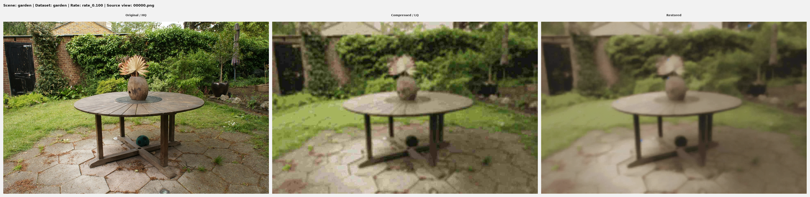
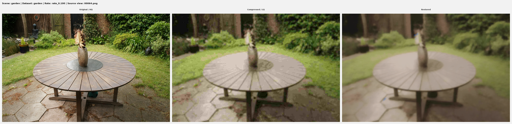
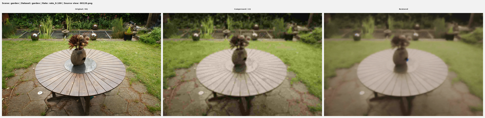
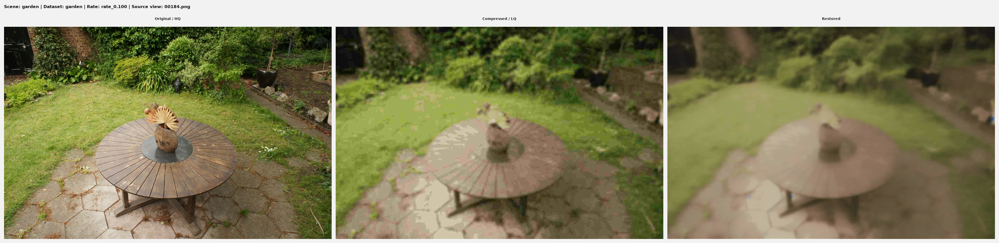

# NiFi (NIX&FIX) for Extreme Low-Rate 3DGS Restoration

Unofficial third-party implementation and audit of:
**Nix and Fix: Targeting 1000x Compression of 3D Gaussian Splatting with Diffusion Models** (arXiv:2602.04549).

This repository provides:
- Artifact synthesis from real benchmark scenes (`HQ -> compressed LQ`),
- One-step restoration inference path (Eq. 7),
- Quality-gated demo outputs with reproducible commands,
- Diagnostics to prove restoration is applied and not bypassed.

## Disclaimer

This is **not** the official release from the paper authors.
The paper reports SD3-based training with dedicated adapter weights; those official SD3 adapters are not bundled here.
This repo includes a reproducible adapter training path plus a strict quality gate, and ships a real-data demo config that passes the gate on `Mip-NeRF360/garden`.

## What Is Implemented

- Artifact synthesis:
  - `nifi/artifact_synthesis/compression_simulation.py`
  - `nifi/gs/compressor.py`
- Restoration backbone + adapters:
  - `nifi/diffusion/model.py`
  - `nifi/artifact_restoration/model.py`
- Distribution/perceptual training objectives:
  - `nifi/restoration_distribution_matching/objectives.py`
  - `nifi/losses/perceptual.py`
- Demo + diagnostics scripts:
  - `scripts/run_demo.py`
  - `scripts/prove_restoration_is_applied.py`
  - `scripts/quality_gate.py`
  - `scripts/verify_checkpoints.py`
  - `scripts/auto_tune_restore_hparams.py`
  - `scripts/train_adapters.py`
  - `scripts/env_check.py`

Paper-to-code mapping is in `docs/paper_to_code_map.md`.

## Environment (Conda: `nifi`)

All key commands below are intended to run with:
```bash
conda run -n nifi <command>
```

Environment sanity:
```bash
conda run -n nifi python scripts/env_check.py
```
This writes `logs/env_check.txt` and reports Python/Torch/CUDA/GPU versions.

## Checkpoints

Single source of truth:
- `configs/model_paths.yaml`
  - `restoration.model_config`
  - `restoration.adapter_checkpoint`

Verify checkpoint presence + compatibility:
```bash
conda run -n nifi python scripts/verify_checkpoints.py
```

If you want to train new adapters:
```bash
conda run -n nifi python scripts/train_adapters.py --preset small --data_root pairs_real --exp runs/nifi_sd15_adapters_small
```
For a longer run:
```bash
conda run -n nifi python scripts/train_adapters.py --preset full --data_root pairs_real --exp runs/nifi_sd15_adapters_full
```

## Quickstart (Garden)

1) GPU smoke:
```bash
conda run -n nifi python scripts/garden_env_gpu_check.py
```

2) Prove restoration is not bypassed (writes triptychs + diff maps):
```bash
conda run -n nifi python scripts/garden_prove_restore_not_noop.py --device cuda --out_dir outputs/garden/noop_check
```

3) Inspect adapter checkpoint state:
```bash
conda run -n nifi python scripts/inspect_trainable_and_checkpoints.py
```

4) Train Garden adapters on GPU for a substantial run (minimum 10k steps):
```bash
conda run -n nifi python scripts/train_garden_adapters.py --device cuda --max_steps 10000 --val_every 250 --save_every 1000
```
If quality gate is still insufficient at 10k, run Debug+Adjust and continue:
```bash
conda run -n nifi python scripts/garden_debug_adjust.py --device cuda
```

5) Auto-tune Garden config:
```bash
conda run -n nifi python scripts/auto_tune_garden.py --device cuda
```

6) Run final Garden demo with chosen checkpoint:
```bash
conda run -n nifi python scripts/run_demo.py --dataset garden --device cuda --checkpoint checkpoints/garden/adapter_best.pt --config configs/garden_known_good.yaml
```

7) Enforce Garden quality gate (strict LPIPS margin + non-no-op + sharpness):
```bash
conda run -n nifi python scripts/quality_gate.py --demo_dir outputs/demo/garden/garden --garden_mode
```

Outputs:
- Validation triptychs during training: `outputs/garden/val/step_*/view_*/triptych.png`
- Training metrics curve: `outputs/garden/metrics.csv`
- Checkpoints: `checkpoints/garden/adapter_step*.pt`, `checkpoints/garden/phi_minus_step*.safetensors`
- `outputs/demo/garden/garden/hq/`
- `outputs/demo/garden/garden/lq/`
- `outputs/demo/garden/garden/restored/`
- `outputs/demo/garden/garden/triptych/`
- `outputs/demo/garden/garden/manifest.json`
- `outputs/demo/garden/garden/quality_gate_report.json`

## Qualitative Results (Garden)

`Garden` triptychs (`HQ | Compressed | Restored`), generated with `configs/garden_known_good.yaml` + `checkpoints/garden/adapter_best.pt` (step `9750`):






## Reproducibility Snapshot

From `outputs/demo/garden/garden/manifest.json` + `quality_gate_report.json`:
- LPIPS mean: `0.7265 -> 0.7011` (gain `+0.0254`)
- Laplacian sharpness mean: `0.0009824 -> 0.0011534` (non-decreasing)
- Quality gate: `PASS` on all selected Garden demo views

## Diagnostics

Prove restoration path is actually running:
```bash
conda run -n nifi python scripts/prove_restoration_is_applied.py --dataset mipnerf360 --scene garden --view 0 --device cuda --t0_variant small --adapter_scale 1.0
```

Sanity bypass check:
```bash
conda run -n nifi python scripts/prove_restoration_is_applied.py --dataset mipnerf360 --scene garden --view 0 --device cuda --disable_restore
```

HQ source quality check:
```bash
conda run -n nifi python scripts/diagnose_hq_quality.py --dataset mipnerf360 --scene garden
```

## Troubleshooting (`restored == lq`)

- Run `scripts/prove_restoration_is_applied.py` and verify:
  - non-zero `mean_abs_diff_restored_vs_lq`,
  - non-null latent stats,
  - expected `t0`, `sigma_t0`, and checkpoint paths.
- Run `scripts/verify_checkpoints.py` to catch missing/incompatible adapters.
- Confirm `configs/model_paths.yaml` points to the intended model/config/adapter files.
- Re-run `scripts/auto_tune_restore_hparams.py` and regenerate demo config.

## Citation

If this repo helps your work, cite the original paper:

```bibtex
@article{eteke2026nixfix,
  title={Nix and Fix: Targeting 1000x Compression of 3D Gaussian Splatting with Diffusion Models},
  author={Eteke, Cem and Tartaglione, Enzo},
  journal={arXiv preprint arXiv:2602.04549},
  year={2026}
}
```
